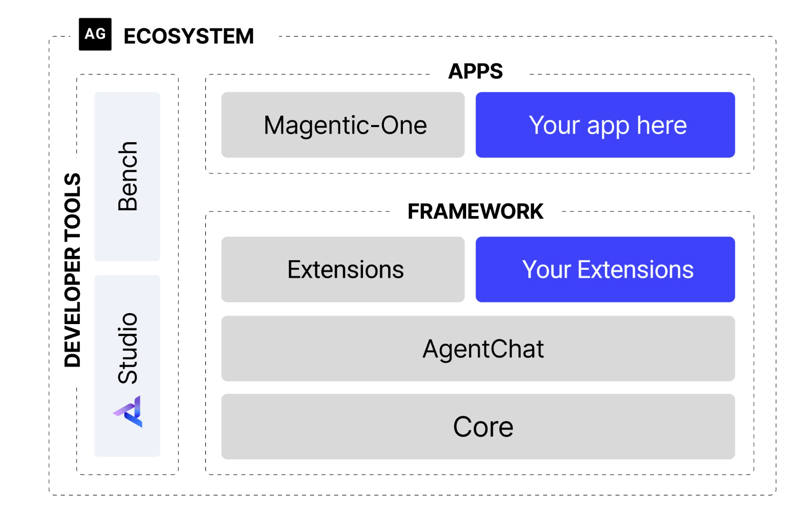

从第四章开始,前面都是简单llm基础

# [第四章 智能体经典范式构建](https://datawhalechina.github.io/hello-agents/#/./chapter4/第四章 智能体经典范式构建?id=第四章-智能体经典范式构建)

- **ReAct (Reasoning and Acting)：** 一种将“思考”和“行动”紧密结合的范式，让智能体边想边做，动态调整。
- **Plan-and-Solve：** 一种“三思而后行”的范式，智能体首先生成一个完整的行动计划，然后严格执行。
- **Reflection：** 一种赋予智能体“反思”能力的范式，通过自我批判和修正来优化结果。.

配置好.env后,就可以使用这个方法调用llm,我这里用的反代理,具体不细讲

## [4.2 ReAct](code\chapter4\ReAct.py)

在准备好LLM客户端后，我们将构建第一个，也是最经典的一个智能体范式**ReAct (Reason + Act)**。其核心思想是模仿人类解决问题的方式，将**推理 (Reasoning)** 与**行动 (Acting)** 显式地结合起来，形成一个“**思考-行动-观察**”的循环。

ReAct的**思考与行动是相辅相成的**。思考指导行动，而行动的结果又反过来修正思考, 具体步骤如下

- **Thought (思考)：** 这是智能体的“内心独白”。它会分析当前情况、分解任务、制定下一步计划，或者反思上一步的结果。
- **Action (行动)：** 这是智能体决定采取的**具体动作**，通常是调用一个外部工具，例如 `Search['华为最新款手机']`。
- **Observation (观察)：** 这是执行`Action`后从外部工具**返回的结果**，例如搜索结果的摘要或API的返回值。

即Agent的一次命令调用多次tools和LLM , tools可以补充LLM所不具有或不擅长的功能(搜索实时信息, 数学计算 , 数据库调用等)


```python
# ReAct 提示词模板
REACT_PROMPT_TEMPLATE = """
请注意，你是一个有能力调用外部工具的智能助手。

可用工具如下:
{tools}

请严格按照以下格式进行回应:

Thought: 你的思考过程，用于分析问题、拆解任务和规划下一步行动。
Action: 你决定采取的行动，必须是以下格式之一:
- `{{tool_name}}[{{tool_input}}]`:调用一个可用工具。
- `Finish[最终答案]`:当你认为已经获得最终答案时。
- 当你收集到足够的信息，能够回答用户的最终问题时，你必须在Action:字段后使用 Finish[最终答案] 来输出最终答案。

现在，请开始解决以下问题:
Question: {question}
History: {history}
"""
```


(1)ReAct 的主要特点

1. **高可解释性**：ReAct 最大的优点之一就是透明。通过 `Thought` 链，我们可以清晰地看到智能体每一步的“心路历程”——它为什么会选择这个工具，下一步又打算做什么。这对于理解、信任和调试智能体的行为至关重要。
2. **动态规划与纠错能力**：与一次性生成完整计划的范式不同，ReAct 是“走一步，看一步”。它根据每一步从外部世界获得的 `Observation` 来动态调整后续的 `Thought` 和 `Action`。如果上一步的搜索结果不理想，它可以在下一步中修正搜索词，重新尝试。
3. **工具协同能力**：ReAct 范式天然地将大语言模型的推理能力与外部工具的执行能力结合起来。LLM 负责运筹帷幄(规划和推理)，工具负责解决具体问题(搜索、计算)，二者协同工作，突破了单一 LLM 在知识时效性、计算准确性等方面的固有局限。

(2)ReAct 的固有局限性

1. **对LLM自身能力的强依赖**：ReAct 流程的成功与否，高度依赖于底层 LLM 的综合能力。如果 LLM 的逻辑推理能力、指令遵循能力或格式化输出能力不足，就很容易在 `Thought` 环节产生错误的规划，或者在 `Action` 环节生成不符合格式的指令，导致整个流程中断。
2. **执行效率问题**：由于其循序渐进的特性，完成一个任务通常需要多次调用 LLM。每一次调用都伴随着网络延迟和计算成本。对于需要很多步骤的复杂任务，这种串行的“思考-行动”循环可能会导致较高的总耗时和费用。
3. **提示词的脆弱性**：整个机制的稳定运行建立在一个精心设计的提示词模板之上。模板中的任何微小变动，甚至是用词的差异，都可能影响 LLM 的行为。此外，并非所有模型都能持续稳定地遵循预设的格式，这增加了在实际应用中的不确定性。
4. **可能陷入局部最优**：步进式的决策模式意味着智能体缺乏一个全局的、长远的规划。它可能会因为眼前的 `Observation` 而选择一个看似正确但长远来看并非最优的路径，甚至在某些情况下陷入“原地打转”的循环中。

(3)调试技巧

当你构建的 ReAct 智能体行为不符合预期时，可以从以下几个方面入手进行调试：

- **检查完整的提示词**：在每次调用 LLM 之前，将最终格式化好的、包含所有历史记录的完整提示词打印出来。这是追溯 LLM 决策源头的最直接方式。
- **分析原始输出**：当输出解析失败时(例如，正则表达式没有匹配到 `Action`)，务必将 LLM 返回的原始、未经处理的文本打印出来。这能帮助你判断是 LLM 没有遵循格式，还是你的解析逻辑有误。
- **验证工具的输入与输出**：检查智能体生成的 `tool_input` 是否是工具函数所期望的格式，同时也要确保工具返回的 `observation` 格式是智能体可以理解和处理的。
- **调整提示词中的示例 (Few-shot Prompting)**：如果模型频繁出错，可以在提示词中加入一两个完整的“Thought-Action-Observation”成功案例，通过示例来引导模型更好地遵循你的指令。
- **尝试不同的模型或参数**：更换一个能力更强的模型，或者调整 `temperature` 参数(通常设为0以保证输出的确定性)，有时能直接解决问题。

## [4.3 Plan and solve](code\chapter4\Plan_and_solve.py)

与 **ReAct 将思考和行动融合在每一步**不同，Plan-and-Solve 将整个流程解耦为两个核心阶段，如图4.2所示：

1. **规划阶段 (Planning Phase)**： 首先，智能体会接收用户的完整问题。它的第一个任务不是直接去解决问题或调用工具，而是**将问题分解，并制定出一个清晰、分步骤的行动计划**。这个计划本身就是一次大语言模型的调用产物。
2. **执行阶段 (Solving Phase)**： 在获得完整的计划后，智能体进入执行阶段。它会**严格按照计划中的步骤，逐一执行**。每一步的执行都可能是一次独立的 LLM 调用，或者是对上一步结果的加工处理，直到计划中的所有步骤都完成，最终得出答案。

Plan-and-Solve 尤其适用于那些**结构性强、可以被清晰分解**的复杂任务，例如：

- **多步数学应用题**：需要先列出计算步骤，再逐一求解。
- **需要整合多个信息源的报告撰写**：需要先规划好报告结构(引言、数据来源A、数据来源B、总结)，再逐一填充内容。
- **代码生成任务**：需要先构思好函数、类和模块的结构，再逐一实现。

~~~python
PLANNER_PROMPT_TEMPLATE = """
你是一个顶级的AI规划专家。你的任务是将用户提出的复杂问题分解成一个由多个简单步骤组成的行动计划。
请确保计划中的每个步骤都是一个独立的、可执行的子任务，并且严格按照逻辑顺序排列。
你的输出必须是一个Python列表，其中每个元素都是一个描述子任务的字符串。

问题: {question}

请严格按照以下格式输出你的计划,```python与```作为前后缀是必要的:
```python
["步骤1", "步骤2", "步骤3", ...]
```
"""
~~~


## [4.4 Reflection](code\chapter4\Reflection.py)

在我们已经实现的 ReAct 和 Plan-and-Solve 范式中，智能体一旦完成了任务，其工作流程便告结束。然而，它们生成的初始答案，无论是行动轨迹还是最终结果，都可能存在谬误或有待改进之处。Reflection 机制的核心思想，正是为智能体引入一种**事后(post-hoc)的自我校正循环**，使其能够像人类一样，审视自己的工作，发现不足，并进行迭代优化。

核心工作流程可以概括为一个简洁的三步循环：**执行 -> 反思 -> 优化**。

1. **执行 (Execution)**：首先，智能体使用我们熟悉的方法(如 ReAct 或 Plan-and-Solve)尝试完成任务，生成一个初步的解决方案或行动轨迹。这可以看作是“初稿”。

2. 反思 (Reflection)

   ：接着，智能体进入反思阶段。它会调用一个独立的、或者带有特殊提示词的大语言模型实例，来扮演一个“reviewer”的角色。这个“评审员”会审视第一步生成的“初稿”，并从多个维度进行评估，例如：

   - **事实性错误**：是否存在与常识或已知事实相悖的内容？
   - **逻辑漏洞**：推理过程是否存在不连贯或矛盾之处？
   - **效率问题**：是否有更直接、更简洁的路径来完成任务？
   - **遗漏信息**：是否忽略了问题的某些关键约束或方面？ 根据评估，它会生成一段结构化的**反馈 (Feedback)**，指出具体的问题所在和改进建议。

3. **优化 (Refinement)**：最后，智能体将“初稿”和“反馈”作为新的上下文，再次调用大语言模型，要求它根据反馈内容对初稿进行修正，生成一个更完善的“修订稿”。

如图所示，这个循环可以重复进行多次，**直到反思阶段不再发现新的问题**，或者达到预设的迭代次数上限。我们可以将这个迭代优化的过程形式化地表达出来。


Reflection 的价值在于：

- 它为智能体提供了一个内部纠错回路，使**其不再完全依赖于外部工具的反馈**(ReAct 的 Observation)，从而能够修正更高层次的逻辑和策略错误。
- 它将一次性的任务执行，转变为一个**持续优化**的过程，显著提升了复杂任务的最终成功率和答案质量。
- 它为智能体构建了一个临时的**“短期记忆”**。整个“执行-反思-优化”的轨迹形成了一个宝贵的经验记录，智能体不仅知道最终答案，还记得自己是如何从有缺陷的初稿迭代到最终版本的。更进一步，这个记忆系统还可以是**多模态的**，允许智能体反思和修正文本以外的输出(如代码、图像等)，为构建更强大的多模态智能体奠定了基础。


# [第六章 框架开发实践](https://datawhalechina.github.io/hello-agents/#/./chapter6/第六章 框架开发实践?id=第六章-框架开发实践)

在第四章中，我们通过编写原生代码，实现了 ReAct、Plan-and-Solve 和 Reflection 这几种智能体的核心工作流。这个过程让我们对智能体的内在执行逻辑有了理解。随后，在第五章，我们切换到“使用者”的视角，体验了低代码平台带来的便捷与高效。

本章的目标，就是探讨如何利用业界主流的一些**智能体框架**，来高效、规范地构建可靠的智能体应用。我们将首先概览当前市面上主流的智能体框架，然后并对几个具有代表性的框架，通过一个完整的实战案例，来体验框架驱动的开发模式。

框架实现核心组件的解耦与可扩展性

- 一个健壮的智能体系统应该由多个松散耦合的模块组成。框架的设计会强制我们分离不同的关注点：

  - **模型层 (Model Layer)**：负责与大语言模型交互，可以轻松替换不同的模型(OpenAI, Anthropic, 本地模型)。

  - **工具层 (Tool Layer)**：提供标准化的工具定义、注册和执行接口，添加新工具不会影响其他代码。

  - **记忆层 (Memory Layer)**：处理短期和长期记忆，可以根据需求切换不同的记忆策略(如滑动窗口、摘要记忆)。 这种模块化的设计使得整个系统极具可扩展性，更换或升级任何一个组件都变得简单。

状态管理是一个巨大的挑战，它需要处理上下文窗口限制、历史信息持久化、多轮对话状态跟踪等问题。一个框架可以提供一套强大而通用的状态管理机制，开发者无需每次都重新处理这些复杂问题

- **AutoGen**：AutoGen 的核心思想是通过对话实现协作。它将多智能体系统抽象为一个由多个**“可对话”智能体组成的群聊**。开发者可以定义不同角色(如 `Coder`, `ProductManager`, `Tester`)，并设定它们之间的交互规则(例如，`Coder` 写完代码后由 `Tester` 自动接管)。任务的解决过程，就是这些智能体在群聊中通过自动化消息传递，不断对话、协作、迭代直至最终目标达成的过程。
- **AgentScope**：AgentScope 是一个专为多智能体应用设计的、功能全面的开发平台。它的核心特点是**易用性**和**工程化**。它提供了一套非常友好的编程接口，让开发者可以轻松定义智能体、构建通信网络，并管理整个应用的生命周期。其内置的**消息传递机制**和对分布式部署的支持，使其非常适合构建和运维复杂、大规模的多智能体系统。
- **LangGraph**：作为 LangChain 生态的扩展，LangGraph 另辟蹊径，将智能体的执行流程建模为**图 (Graph)**。在传统的链式结构中，信息只能单向流动。而 LangGraph 将每一步操作(如调用LLM、执行工具)定义为图中的一个**节点 (Node)**，并用**边 (Edge)** 来定义节点之间的跳转逻辑。这种设计天然支持**循环 (Cycles)**，使得实现如 Reflection 这样的迭代、修正、自我反思的复杂工作流变得异常简单和直观。


## [6.2 框架一：AutoGen](https://datawhalechina.github.io/hello-agents/#/./chapter6/第六章 框架开发实践?id=_62-框架一：autogen)



- 框架被拆分为两个核心模块：
  - `autogen-core`：作为框架的底层基础，封装了与语言模型交互、消息传递等核心功能。它的存在保证了框架的稳定性和未来扩展性。
  - `autogen-agentchat`：构建于 `core` 之上，提供了用于**开发对话式智能体应用的高级接口**，简化了多智能体应用的开发流程。 这种分层策略使得各组件职责明确，降低了系统的耦合度。
- **异步优先：** 新架构全面转向异步编程 (`async/await`)。在多智能体协作场景中，网络请求(如调用 LLM API)是主要耗时操作。异步模式允许系统在等待一个智能体响应时处理其他任务，从而避免了线程阻塞，显著提升了并发处理能力和系统资源的利用效率

(2)核心智能体组件

智能体是执行任务的基本单元。

- **AssistantAgent (助理智能体)：** 这是任务的主要解决者，其核心是封装了一个大型语言模型(LLM)。它的职责是根据对话历史生成富有逻辑和知识的回复，例如提出计划、撰写文章或编写代码。通过不同的系统消息(System Message)，我们可以为其赋予不同的“专家”角色。
- **UserProxyAgent (用户代理智能体)：** 这是 AutoGen 中功能独特的组件。它扮演着双重角色：既是人类用户的“代言人”，负责发起任务和传达意图；又是一个可靠的“执行器”，可以配置为执行代码或调用工具，并将结果反馈给其他智能体。这种设计清晰地区分了“思考”(由 `AssistantAgent` 完成)与“行动”。

(3)从 GroupChatManager 到 Team

当任务需要多个智能体协作时，就需要一个机制来协调对话流程。在早期版本中，`GroupChatManager` 承担了这一职责。而在新架构中，引入了更灵活的 `Team` 或群聊概念，例如 `RoundRobinGroupChat`。

- **轮询群聊 (RoundRobinGroupChat)：** 这是一种明确的、顺序化的对话协调机制。它会让参与的智能体按照预定义的顺序依次发言。这种模式非常适用于流程固定的任务，例如一个典型的软件开发流程：产品经理先提出需求，然后工程师编写代码，最后由代码审查员进行检查。
- 工作流：
  1. 首先，创建一个 `RoundRobinGroupChat` 实例，并将所有参与协作的智能体(如产品经理、工程师等)加入其中。
  2. 当一个任务开始时，群聊会**按照预设的顺序，依次激活相应的智能体**。
  3. 被选中的智能体根据当前的对话上下文进行响应。
  4. 群聊将新的回复加入对话历史，并激活下一个智能体。
  5. 这个过程会持续进行，直到达到最大对话轮次或满足预设的终止条件。

通过这种方式，AutoGen 将复杂的协作关系，简化为一个流程清晰、易于管理的自动化“圆桌会议”。开发者只需定义好每个团队成员的角色和发言顺序，**剩下的协作流程便可由群聊机制自主驱动**。

在下一节中，我们将通过构建一个模拟软件开发团队的实例，来亲身体验如何在新架构下定义不同角色的智能体，并将它们组织在一个由 `RoundRobinGroupChat` 协调的群聊中，以协作完成一个真实的编程任务。

[软件开发团队](code\chapter6\AutoGenDemo\autogen_software_team.py)

框架管理下结构十分简单,创建agent也很容易, 

1. 建立客户端链接:分配api,key,以及部分其他信息(max_token等)
2. 给各个角色分配对应的prompt以及model
3. 按圆桌会议模式进行聊天

[输出部分](AutoGenDemoOutput)

`description` 字段清晰地描述了其职责 , 其他 Agent 在对话上下文中仍可能看到它，帮助理解队友的职责

| `RoundRobinGroupChat` — 固定按 PM → Engineer → Reviewer → UserProxy 顺序轮流 | `SelectorGroupChat` — LLM 根据当前对话上下文**智能选择**下一位发言者 |
| ------------------------------------------------------------ | ------------------------------------------------------------ |
|                                                              |                                                              |

修改了team_chat = SelectorGroupChat(这部分,把按顺序变成llm决定轮到哪个发言

## [6.5 框架四：LangGraph](https://datawhalechina.github.io/hello-agents/#/./chapter6/第六章 框架开发实践?id=_65-框架四：langgraph)

### [6.5.1 LangGraph 的结构梳理](https://datawhalechina.github.io/hello-agents/#/./chapter6/第六章 框架开发实践?id=_651-langgraph-的结构梳理)


与前面介绍的基于“对话”的框架 AutoGen 不同，LangGraph 将智能体的执行流程建模为一种**状态机(State Machine)**，并将其表示为**有向图(Directed Graph)**。在这种范式中，图的**节点(Nodes)**代表一个具体的计算步骤(如调用 LLM、执行工具)，而**边(Edges)**则定义了从一个节点到另一个节点的跳转逻辑。这种设计的革命性之处在于它**天然支持循环**，使得构建能够进行迭代、反思和自我修正的复杂智能体工作流变得前所未有的直观和简单。

要理解 LangGraph，我们需要先掌握它的三个基本构成要素。

#### 三个基本构成要素

##### 全局状态(State)

**首先，是全局状态(State)**。整个图的执行过程都围绕一个共享的状态对象进行。这个状态通常被定义为一个 Python 的 `TypedDict`，它可以包含任何你需要追踪的信息，如对话历史、中间结果、迭代次数等。所有的节点都能读取和更新这个中心状态。

```python
from typing import TypedDict, List

# 定义全局状态的数据结构
class AgentState(TypedDict):
    messages: List[str]      # 对话历史
    current_task: str        # 当前任务
    final_answer: str        # 最终答案
    # ... 任何其他需要追踪的状态Copy to clipboardErrorCopied
```

##### 节点(Nodes)

**其次，是节点(Nodes)**。每个节点都是一个接收当前状态作为输入、并返回一个更新后的状态作为输出的 Python 函数。节点是执行具体工作的单元。

```python
# 定义一个“规划者”节点函数
def planner_node(state: AgentState) -> AgentState:
    """根据当前任务制定计划，并更新状态。"""
    current_task = state["current_task"]
    # ... 调用LLM生成计划 ...
    plan = f"为任务 '{current_task}' 生成的计划..."
    
    # 将新消息追加到状态中
    state["messages"].append(plan)
    return state

# 定义一个“执行者”节点函数
def executor_node(state: AgentState) -> AgentState:
    """执行最新计划，并更新状态。"""
    latest_plan = state["messages"][-1]
    # ... 执行计划并获得结果 ...
    result = f"执行计划 '{latest_plan}' 的结果..."
    
    state["messages"].append(result)
    return stateCopy to clipboardErrorCopied
```

##### 边(Edges)

**最后，是边(Edges)**。边负责连接节点，定义工作流的方向。最简单的边是常规边，它指定了一个节点的输出总是流向另一个固定的节点。而 LangGraph 最强大的功能在于**条件边(Conditional Edges)**。它通过一个函数来判断当前的状态，然后动态地决定下一步应该跳转到哪个节点。这正是实现循环和复杂逻辑分支的关键。

```python
def should_continue(state: AgentState) -> str:
    """条件函数：根据状态决定下一步路由。"""
    # 假设如果消息少于3条，则需要继续规划
    if len(state["messages"]) < 3:
        # 返回的字符串需要与添加条件边时定义的键匹配
        return "continue_to_planner"
    else:
        state["final_answer"] = state["messages"][-1]
        return "end_workflow"Copy to clipboardErrorCopied
```

在定义了状态、节点和边之后，我们可以像搭积木一样将它们组装成一个可执行的工作流。

### [6.5.3 LangGraph 的优势与局限性](https://datawhalechina.github.io/hello-agents/#/./chapter6/第六章 框架开发实践?id=_653-langgraph-的优势与局限性分析)

（1）优势

- 如我们的智能搜索助手案例所示，LangGraph 将一个完整的实时问答流程，显式地定义为一个由状态、节点和边构成的“流程图”。这种设计的最大优势是**高度的可控性与可预测性**。开发者可以精确地规划智能体的每一步行为，这对于构建需要高可靠性和可审计性的生产级应用至关重要。其最强大的特性在于对**循环（Cycles）的原生支持**。通过条件边，我们可以轻松构建“反思-修正”循环，例如在我们的案例中，如果搜索失败，可以设计一个回退到备用方案的路径。这是构建能够自我优化和具备容错能力的智能体的关键。
- 此外，由于每个节点都是一个独立的 Python 函数，这带来了**高度的模块化**。同时，在流程中插入一个等待人类审核的节点也变得非常直接，为实现可靠的“人机协作”（Human-in-the-loop）提供了坚实的基础。

（2）局限性

- 与基于对话的框架相比，LangGraph 需要开发者编写更多的**前期代码（Boilerplate）**。定义状态、节点、边等一系列操作，使得对于简单任务而言，开发过程显得更为繁琐。开发者需要更多地思考“如何控制流程（how）”，而不仅仅是“做什么（what）”。由于工作流是预先定义的，LangGraph 的行为虽然可控，但也缺少了对话式智能体那种动态的、**“涌现”式的交互**。它的强项在于执行一个确定的、可靠的流程，而非模拟开放式的、不可预测的社会性协作。
- 调试过程同样存在挑战。虽然流程比对话历史更清晰，但问题可能出在多个环节：某个节点内部的逻辑错误、在节点间传递的状态数据发生异变，或是边跳转的条件判断失误。这要求开发者对整个图的运行机制有全局性的理解。