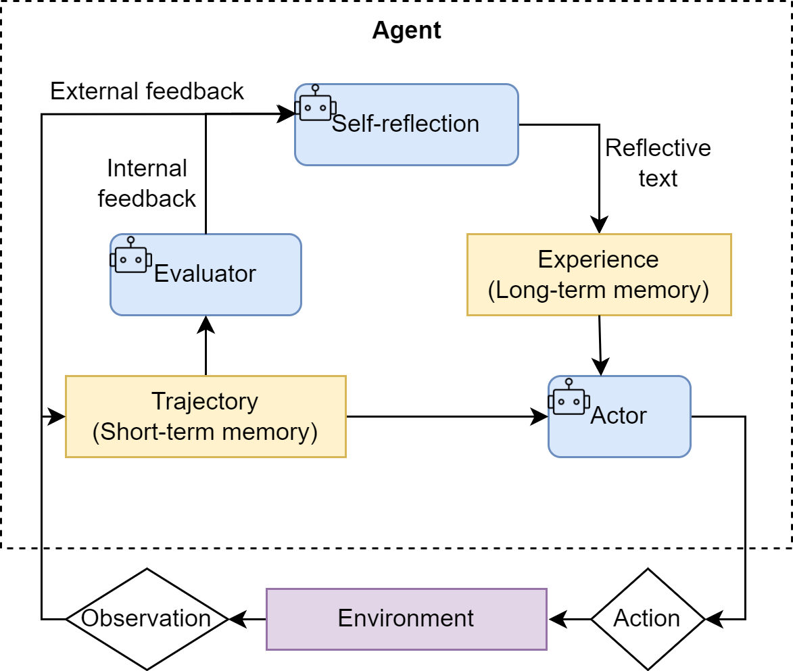

从第四章开始,前面都是简单llm基础

# [第四章 智能体经典范式构建](https://datawhalechina.github.io/hello-agents/#/./chapter4/第四章 智能体经典范式构建?id=第四章-智能体经典范式构建)

- **ReAct (Reasoning and Acting)：** 一种将“思考”和“行动”紧密结合的范式，让智能体边想边做，动态调整。
- **Plan-and-Solve：** 一种“三思而后行”的范式，智能体首先生成一个完整的行动计划，然后严格执行。
- **Reflection：** 一种赋予智能体“反思”能力的范式，通过自我批判和修正来优化结果。.

配置好.env后,就可以使用这个方法调用llm,我这里用的反代理,具体不细讲

## [4.2 ReAct](code\chapter4\ReAct.py)

在准备好LLM客户端后，我们将构建第一个，也是最经典的一个智能体范式**ReAct (Reason + Act)**。其核心思想是模仿人类解决问题的方式，将**推理 (Reasoning)** 与**行动 (Acting)** 显式地结合起来，形成一个“**思考-行动-观察**”的循环。

ReAct的**思考与行动是相辅相成的**。思考指导行动，而行动的结果又反过来修正思考, 具体步骤如下

- **Thought (思考)：** 这是智能体的“内心独白”。它会分析当前情况、分解任务、制定下一步计划，或者反思上一步的结果。
- **Action (行动)：** 这是智能体决定采取的**具体动作**，通常是调用一个外部工具，例如 `Search['华为最新款手机']`。
- **Observation (观察)：** 这是执行`Action`后从外部工具**返回的结果**，例如搜索结果的摘要或API的返回值。

即Agent的一次命令调用多次tools和LLM , tools可以补充LLM所不具有或不擅长的功能(搜索实时信息, 数学计算 , 数据库调用等)


```python
# ReAct 提示词模板
REACT_PROMPT_TEMPLATE = """
请注意，你是一个有能力调用外部工具的智能助手。

可用工具如下:
{tools}

请严格按照以下格式进行回应:

Thought: 你的思考过程，用于分析问题、拆解任务和规划下一步行动。
Action: 你决定采取的行动，必须是以下格式之一:
- `{{tool_name}}[{{tool_input}}]`:调用一个可用工具。
- `Finish[最终答案]`:当你认为已经获得最终答案时。
- 当你收集到足够的信息，能够回答用户的最终问题时，你必须在Action:字段后使用 Finish[最终答案] 来输出最终答案。

现在，请开始解决以下问题:
Question: {question}
History: {history}
"""
```


（1）ReAct 的主要特点

1. **高可解释性**：ReAct 最大的优点之一就是透明。通过 `Thought` 链，我们可以清晰地看到智能体每一步的“心路历程”——它为什么会选择这个工具，下一步又打算做什么。这对于理解、信任和调试智能体的行为至关重要。
2. **动态规划与纠错能力**：与一次性生成完整计划的范式不同，ReAct 是“走一步，看一步”。它根据每一步从外部世界获得的 `Observation` 来动态调整后续的 `Thought` 和 `Action`。如果上一步的搜索结果不理想，它可以在下一步中修正搜索词，重新尝试。
3. **工具协同能力**：ReAct 范式天然地将大语言模型的推理能力与外部工具的执行能力结合起来。LLM 负责运筹帷幄（规划和推理），工具负责解决具体问题（搜索、计算），二者协同工作，突破了单一 LLM 在知识时效性、计算准确性等方面的固有局限。

（2）ReAct 的固有局限性

1. **对LLM自身能力的强依赖**：ReAct 流程的成功与否，高度依赖于底层 LLM 的综合能力。如果 LLM 的逻辑推理能力、指令遵循能力或格式化输出能力不足，就很容易在 `Thought` 环节产生错误的规划，或者在 `Action` 环节生成不符合格式的指令，导致整个流程中断。
2. **执行效率问题**：由于其循序渐进的特性，完成一个任务通常需要多次调用 LLM。每一次调用都伴随着网络延迟和计算成本。对于需要很多步骤的复杂任务，这种串行的“思考-行动”循环可能会导致较高的总耗时和费用。
3. **提示词的脆弱性**：整个机制的稳定运行建立在一个精心设计的提示词模板之上。模板中的任何微小变动，甚至是用词的差异，都可能影响 LLM 的行为。此外，并非所有模型都能持续稳定地遵循预设的格式，这增加了在实际应用中的不确定性。
4. **可能陷入局部最优**：步进式的决策模式意味着智能体缺乏一个全局的、长远的规划。它可能会因为眼前的 `Observation` 而选择一个看似正确但长远来看并非最优的路径，甚至在某些情况下陷入“原地打转”的循环中。

（3）调试技巧

当你构建的 ReAct 智能体行为不符合预期时，可以从以下几个方面入手进行调试：

- **检查完整的提示词**：在每次调用 LLM 之前，将最终格式化好的、包含所有历史记录的完整提示词打印出来。这是追溯 LLM 决策源头的最直接方式。
- **分析原始输出**：当输出解析失败时（例如，正则表达式没有匹配到 `Action`），务必将 LLM 返回的原始、未经处理的文本打印出来。这能帮助你判断是 LLM 没有遵循格式，还是你的解析逻辑有误。
- **验证工具的输入与输出**：检查智能体生成的 `tool_input` 是否是工具函数所期望的格式，同时也要确保工具返回的 `observation` 格式是智能体可以理解和处理的。
- **调整提示词中的示例 (Few-shot Prompting)**：如果模型频繁出错，可以在提示词中加入一两个完整的“Thought-Action-Observation”成功案例，通过示例来引导模型更好地遵循你的指令。
- **尝试不同的模型或参数**：更换一个能力更强的模型，或者调整 `temperature` 参数（通常设为0以保证输出的确定性），有时能直接解决问题。

## [4.3 Plan and solve](code\chapter4\Plan_and_solve.py)

与 **ReAct 将思考和行动融合在每一步**不同，Plan-and-Solve 将整个流程解耦为两个核心阶段，如图4.2所示：

1. **规划阶段 (Planning Phase)**： 首先，智能体会接收用户的完整问题。它的第一个任务不是直接去解决问题或调用工具，而是**将问题分解，并制定出一个清晰、分步骤的行动计划**。这个计划本身就是一次大语言模型的调用产物。
2. **执行阶段 (Solving Phase)**： 在获得完整的计划后，智能体进入执行阶段。它会**严格按照计划中的步骤，逐一执行**。每一步的执行都可能是一次独立的 LLM 调用，或者是对上一步结果的加工处理，直到计划中的所有步骤都完成，最终得出答案。

Plan-and-Solve 尤其适用于那些**结构性强、可以被清晰分解**的复杂任务，例如：

- **多步数学应用题**：需要先列出计算步骤，再逐一求解。
- **需要整合多个信息源的报告撰写**：需要先规划好报告结构（引言、数据来源A、数据来源B、总结），再逐一填充内容。
- **代码生成任务**：需要先构思好函数、类和模块的结构，再逐一实现。

~~~python
PLANNER_PROMPT_TEMPLATE = """
你是一个顶级的AI规划专家。你的任务是将用户提出的复杂问题分解成一个由多个简单步骤组成的行动计划。
请确保计划中的每个步骤都是一个独立的、可执行的子任务，并且严格按照逻辑顺序排列。
你的输出必须是一个Python列表，其中每个元素都是一个描述子任务的字符串。

问题: {question}

请严格按照以下格式输出你的计划,```python与```作为前后缀是必要的:
```python
["步骤1", "步骤2", "步骤3", ...]
```
"""
~~~


## [4.4 Reflection](code\chapter4\Reflection.py)

在我们已经实现的 ReAct 和 Plan-and-Solve 范式中，智能体一旦完成了任务，其工作流程便告结束。然而，它们生成的初始答案，无论是行动轨迹还是最终结果，都可能存在谬误或有待改进之处。Reflection 机制的核心思想，正是为智能体引入一种**事后（post-hoc）的自我校正循环**，使其能够像人类一样，审视自己的工作，发现不足，并进行迭代优化。

核心工作流程可以概括为一个简洁的三步循环：**执行 -> 反思 -> 优化**。

1. **执行 (Execution)**：首先，智能体使用我们熟悉的方法（如 ReAct 或 Plan-and-Solve）尝试完成任务，生成一个初步的解决方案或行动轨迹。这可以看作是“初稿”。

2. 反思 (Reflection)

   ：接着，智能体进入反思阶段。它会调用一个独立的、或者带有特殊提示词的大语言模型实例，来扮演一个“reviewer”的角色。这个“评审员”会审视第一步生成的“初稿”，并从多个维度进行评估，例如：

   - **事实性错误**：是否存在与常识或已知事实相悖的内容？
   - **逻辑漏洞**：推理过程是否存在不连贯或矛盾之处？
   - **效率问题**：是否有更直接、更简洁的路径来完成任务？
   - **遗漏信息**：是否忽略了问题的某些关键约束或方面？ 根据评估，它会生成一段结构化的**反馈 (Feedback)**，指出具体的问题所在和改进建议。

3. **优化 (Refinement)**：最后，智能体将“初稿”和“反馈”作为新的上下文，再次调用大语言模型，要求它根据反馈内容对初稿进行修正，生成一个更完善的“修订稿”。

如图所示，这个循环可以重复进行多次，**直到反思阶段不再发现新的问题**，或者达到预设的迭代次数上限。我们可以将这个迭代优化的过程形式化地表达出来。



Reflection 的价值在于：

- 它为智能体提供了一个内部纠错回路，使**其不再完全依赖于外部工具的反馈**（ReAct 的 Observation），从而能够修正更高层次的逻辑和策略错误。
- 它将一次性的任务执行，转变为一个**持续优化**的过程，显著提升了复杂任务的最终成功率和答案质量。
- 它为智能体构建了一个临时的**“短期记忆”**。整个“执行-反思-优化”的轨迹形成了一个宝贵的经验记录，智能体不仅知道最终答案，还记得自己是如何从有缺陷的初稿迭代到最终版本的。更进一步，这个记忆系统还可以是**多模态的**，允许智能体反思和修正文本以外的输出（如代码、图像等），为构建更强大的多模态智能体奠定了基础。


